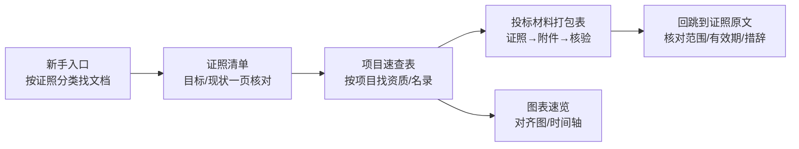

# 文件目录（按使用顺序排序）

> 目标：把整个文件夹的文档按“怎么用/怎么读”排好顺序，一页看全。

## 0 阅读路径图（从“看懂”到“能打包”）

---

## 1 入口与总览（先看这 4 个）

1. 新手入口（按证照分类）：[00-新手入口（按证照分类）.md](00-新手入口（按证照分类）.md)
2. 证照清单（目标/现状核对）：[资质证书清单.md](01-资质证书清单.md)
3. 项目类型 → 资质/入库/名录（按项目找资质）：[项目类型-资质与名录速查表.md](02-项目类型-资质与名录速查表.md)
4. 图表速览（项目→资质对齐图/时间轴）：[图表-资质与项目关系（Mermaid）.md](03-图表-资质与项目关系（Mermaid）.md)

---

## 2 投标与交付（做标书就看这 2 个）

1. 投标材料打包表（证照→附件→核验）：[投标材料打包表（证照-附件-核验）.md](04-投标材料打包表（证照-附件-核验）.md)
2. 公司资质规划自述（对外版｜目标规划口径）：[公司资质规划自述（对外版）.md](05-公司资质规划自述（对外版）.md)

---

## 3 证照主体文件（按证照从 1 到 8）

### 3.1 工商基础
- 营业执照信息：[1-营业执照信息.md](../10-证照（单证）/1-营业执照信息.md)

### 3.2 住建行政许可（施工资质 + 安许）
- 建筑业企业资质证书（总入口）：[2-建筑业企业资质证书.md](../20-施工资质专题/2-建筑业企业资质证书.md)
  - 施工资质证书信息（两本证书）：[2-1-施工资质证书信息（两本资质证书）.md](../20-施工资质专题/2-1-施工资质证书信息（两本资质证书）.md)
  - 施工资质办理流程（怎么拿证）：[2-2-施工资质办理流程（怎么拿证）.md](../20-施工资质专题/2-2-施工资质办理流程（怎么拿证）.md)
  - 北京口径-资质标准硬指标对照：[2-3-北京口径-资质标准硬指标全量对照.md](../20-施工资质专题/2-3-北京口径-资质标准硬指标全量对照.md)
  - 北京口径-社保口径摘要：[2-4-北京口径-社保口径（百问百答摘要）.md](../20-施工资质专题/2-4-北京口径-社保口径（百问百答摘要）.md)
- 安全生产许可证：[3-安全生产许可证.md](../10-证照（单证）/3-安全生产许可证.md)

### 3.3 第三方认证/评价（投标加分常见）
- 三体系管理体系认证证书：[4-三体系管理体系认证证书.md](../10-证照（单证）/4-三体系管理体系认证证书.md)
- 能力等级评价：[5-建筑工程施工服务企业资质证书（能力等级评价）.md](../10-证照（单证）/5-建筑工程施工服务企业资质证书（能力等级评价）.md)
- 企业信用与资信 AAA：[7-企业信用与资信AAA（冠捷时速）.md](../10-证照（单证）/7-企业信用与资信AAA（冠捷时速）.md)
- 垃圾消纳企业服务资质（一级）：[8-垃圾消纳企业服务资质证书（一级）.md](../10-证照（单证）/8-垃圾消纳企业服务资质证书（一级）.md)

### 3.4 银行账户材料（合同/收付款更常用）
- 开户许可证（基本存款账户）：[6-开户许可证（基本存款账户）.md](../10-证照（单证）/6-开户许可证（基本存款账户）.md)

---

## 4 办理指南与模板（做内部规范/补材料用）

1. 公司注册及资质办理指南：[园林绿化公司注册及资质办理指南.md](06-园林绿化公司注册及资质办理指南.md)
2. 证照文档模板（统一结构）：[证照文档模板（统一结构）.md](07-证照文档模板（统一结构）.md)

---

**最后更新时间**：2025年12月25日
