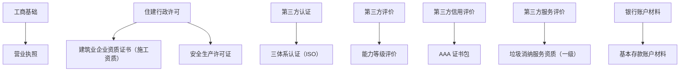

# 资质证书清单（规划版｜按类别）（已脱敏）

> 说明：本清单用于“目标规划/对照检查”。是否已持有、是否有效、是否可核验，以官方查询与内部台账为准。

新手入口：[00-新手入口（按证照分类）.md](00-新手入口（按证照分类）.md)

快速入口：
- 项目类型 → 资质/入库/名录：[项目类型-资质与名录速查表.md](02-项目类型-资质与名录速查表.md)
- 对外沟通自述（避免敏感信息）：[公司资质规划自述（对外版）.md](05-公司资质规划自述（对外版）.md)
- 图表速览（出图用）：[图表-资质与项目关系（Mermaid）.md](03-图表-资质与项目关系（Mermaid）.md)
- 投标材料打包表（出表用）：[投标材料打包表（证照-附件-核验）.md](04-投标材料打包表（证照-附件-核验）.md)

---

## 证照总览（按类别）

### 图表速览（类别 → 证照 → 对应文件）

> 对应文件请直接点击下表“对应文件”列。

| 序号 | 类别 | 证照/证书 | 编号/注册号 | 有效期 | 状态（规划口径） | 对应文件 |
|------|------|-----------|-------------|--------|------|----------|
| 1 | 工商基础 | 营业执照 | 统一社会信用代码：已脱敏 | 2031年12月25日 | 目标/现状待核对 | [1-营业执照信息.md](../10-证照（单证）/1-营业执照信息.md) |
| 2 | 住建行政许可 | 建筑业企业资质证书（施工资质）- 证书一 | 已脱敏 | 2028年04月25日 | 目标/现状待核对 | [2-1-施工资质证书信息（两本资质证书）.md](../20-施工资质专题/2-1-施工资质证书信息（两本资质证书）.md) |
| 3 | 住建行政许可 | 建筑业企业资质证书（施工资质）- 证书二 | 已脱敏 | 2028年04月25日 | 目标/现状待核对 | [2-1-施工资质证书信息（两本资质证书）.md](../20-施工资质专题/2-1-施工资质证书信息（两本资质证书）.md) |
| 4 | 住建行政许可 | 安全生产许可证 | 已脱敏 | 2026年05月22日 | 目标/现状待核对 | [3-安全生产许可证.md](../10-证照（单证）/3-安全生产许可证.md) |
| 5 | 第三方认证 | 三体系认证（ISO 9001/14001/45001） | 已脱敏 | 2027年01月02日 | 目标/现状待核对 | [4-三体系管理体系认证证书.md](../10-证照（单证）/4-三体系管理体系认证证书.md) |
| 6 | 第三方评价 | 建筑工程施工服务企业资质证书（能力等级评价） | 已脱敏 | 2025年04月17日 | 目标/现状待核对 | [5-建筑工程施工服务企业资质证书（能力等级评价）.md](../10-证照（单证）/5-建筑工程施工服务企业资质证书（能力等级评价）.md) |
| 7 | 银行账户材料 | 开户许可证（基本存款账户） | 已脱敏 | 2018年03月14日（发证日） | 目标/现状待核对 | [6-开户许可证（基本存款账户）.md](../10-证照（单证）/6-开户许可证（基本存款账户）.md) |
| 8 | 第三方信用评价 | AAA 证书包（企业信用/资信/诚信经营示范/重合同守信用/质量服务诚信） | 查询编号：已脱敏 | 2027年01月04日 | 目标/现状待核对 | [7-企业信用与资信AAA（冠捷时速）.md](../10-证照（单证）/7-企业信用与资信AAA（冠捷时速）.md) |
| 9 | 第三方服务评价 | 垃圾消纳企业服务资质证书（一级） | 统一证书编号：已脱敏 | 2026年06月11日 | 目标/现状待核对 | [8-垃圾消纳企业服务资质证书（一级）.md](../10-证照（单证）/8-垃圾消纳企业服务资质证书（一级）.md) |

---

## 新手不混淆（只看这一段也够用）

- **营业执照**：公司成立与主体资格。
- **施工资质（住建）**：承接工程施工的行政许可类门槛。
- **安许（住建）**：施工企业安全生产条件许可，通常需与施工资质配套。
- **三体系/能力评价**：第三方认证/评价，常用于投标加分或甲方要求，一般不能替代住建行政许可类证照。

---

## 施工资质相关“拆分文件”入口（避免堆在一个文件里）

- 施工资质总入口：[2-建筑业企业资质证书.md](../20-施工资质专题/2-建筑业企业资质证书.md)
- 证书信息（两本证书原文信息/核对点）：[2-1-施工资质证书信息（两本资质证书）.md](../20-施工资质专题/2-1-施工资质证书信息（两本资质证书）.md)
- 办理流程（怎么拿证/材料/退回点）：[2-2-施工资质办理流程（怎么拿证）.md](../20-施工资质专题/2-2-施工资质办理流程（怎么拿证）.md)
- 北京口径硬指标全量对照：[2-3-北京口径-资质标准硬指标全量对照.md](../20-施工资质专题/2-3-北京口径-资质标准硬指标全量对照.md)
- 北京口径社保口径摘要：[2-4-北京口径-社保口径（百问百答摘要）.md](../20-施工资质专题/2-4-北京口径-社保口径（百问百答摘要）.md)

---

## 资质续期提醒

### 近期需要续期的证书
| 证书类型 | 到期日期 | 距今天数 | 建议办理时间 |
|----------|----------|----------|--------------|
| 安全生产许可证 | 2026年05月22日 | 148天 | 2026年2月（提前3个月） |
| 垃圾消纳企业服务资质证书（一级） | 2026年06月11日 | 168天 | 2026年3月（提前3个月） |
| 建筑业企业资质证书 | 2028年04月25日 | 851天 | 2028年1月（提前3个月） |
| AAA 证书包（企业信用/资信/诚信经营示范） | 2027年01月04日 | 375天 | 2026年10月（提前3个月） |
| 营业执照 | 2031年12月25日 | 2191天 | 2031年9月（提前3个月） |

---

## 文档说明
- 所有证书信息已提取并保存在对应的Markdown文件中
- 建议定期检查证书有效期，提前办理续期手续
- 证书原件应妥善保管，复印件应加盖公章后使用
- 如有任何证书信息变更，应及时更新本清单

---

## 核对备注
- 本次已将营业执照地址与住建类证书地址统一（具体门牌已脱敏）。如您需要用于投标/备案，请再次以营业执照原件或官方查询结果核对。

---

**最后更新时间**：2025年12月25日
