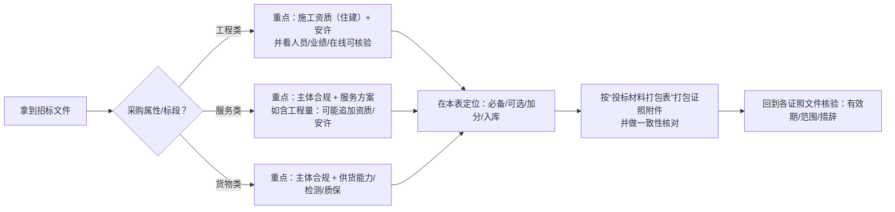

# 项目类型｜资质与名录速查表（园林绿化/林业相关）

> 目的：把“想获得哪些资质”与“这些资质能接哪些项目”对应起来，并补充常见的入库/名录/平台，方便快速查询与投标前自查。
>
> 重要说明（请务必先读）：
> 1) 具体门槛以招标文件/甲方准入规则/属地主管部门最新口径为准；同一类项目在不同地区可能差异很大。
> 2) 这里按业内常见做法给“通常会被要求/经常加分/常见入库”分类，避免把不确定项写成硬性要求。
> 3) 本文避免涉及敏感表述；所有企业敏感字段（账号等）请仅放内部台账，不在对外资料包出现。

---

## 1. 我们的目标：拟获取/维护的资质与证明（概览）

按“能不能接工程/能不能投标加分/专项业务”三条线梳理。

### 1.1 住建体系（工程类项目的常见硬门槛）
- 建筑业企业资质证书（施工资质：按业务需要配置类别/等级）
- 安全生产许可证（与施工资质配套）
- 施工劳务（用于劳务分包/用工合规场景，是否需要以招标文件为准）

### 1.2 投标常见加分（非行政许可，但经常会被要求或加分）
- ISO 三体系（质量/环境/职业健康安全）
- 企业信用/资信/诚信类评价（是否计分以招标文件为准）
- 行业/第三方能力评价类证书（是否计分以招标文件为准）

### 1.3 专项业务（与项目内容强相关）
- 建筑垃圾/渣土清运与消纳相关业务：通常会涉及“运输/消纳去向/合规台账/属地备案”等（以项目与属地要求为准）
- 林业与生态修复类项目：可能涉及林草主管部门的入库/名录/业绩与人员要求（以属地为准）

---

## 2. 速查矩阵：项目类型 → 必备/可选/加分/入库

说明：
- **必备（通常门槛）**：经常被写进资格条件或准入要求（但仍以招标文件/属地口径为准）。
- **可选（常见配套）**：不一定写成硬性门槛，但经常被要求提供或有助于一致性审查。
- **加分（常见加分项）**：经常出现在评分项或甲方加分偏好。
- **入库/平台**：常见需要提前注册/核验的地方（不一定强制，但建议提前准备）。

### 2.0 速查怎么用（项目 → 资质/名录 → 材料包）

### 2.1 工程类（住建/交通/水利等体系为主）

| 项目类型（示例） | 常见采购属性 | 必备（通常门槛） | 可选（常见配套） | 加分（常见加分项） | 常见名录/入库/平台（示例） |
|---|---|---|---|---|---|
| 市政绿化工程（道路绿化、广场、公园配套景观、室外工程等） | 工程类 | • 施工资质（常见：市政公用工程施工总承包；或与标段范围匹配的专业承包） • 安许 | • 项目经理/建造师配置与业绩 • 质量/安全管理台账 | • ISO 三体系 • 企业信用/诚信记录 • 类似业绩 | • 四库一平台信息可核验 • 各地公共资源交易平台供应商注册 |
| 公园新建/改造（园路、铺装、小品、景观照明、给排水、海绵设施配套等） | 工程类 | • 施工资质（常见：市政总包/建筑总包/装饰装修/防水防腐等，按标段内容组合） • 安许 | • 关键岗位人员与现场管理台账（按标段要求） | • ISO • 类似业绩 | • 公共资源交易平台 • 政府采购/交易系统（视招采方式） |
| 高速公路/国省干线绿化（路域景观提升、边坡绿化等） | 工程类或养护类 | • 以招标文件为准：可能要求市政/公路工程相关资质（若涉及公路主体设施或路域作业，可能走交通运输主管部门相关要求） • 安许 | • 交通导改/安全作业方案 • 现场组织与应急预案 | • ISO • 类似路域业绩 | • 交通领域交易平台/公共资源平台 • 主管部门注册/备案（属地差异大） |
| 生态修复/水土保持/边坡植被恢复（喷播、植生袋、客土等） | 工程类 | • 以项目范围为准：常见要求与“边坡治理/市政/水利/公路”等相关资质匹配 • 安许 | • 环保与安全管理证据链 • 现场组织与台账 | • ISO • 类似项目业绩 | • 交易平台供应商注册 • 特定行业库（属地要求） |
| 建筑装饰配套景观/室外工程（房建项目配套绿化、铺装、小市政等） | 工程类 | • 施工资质按内容匹配（建筑总包/装饰装修/防水等） • 安许 | • 与总包协同能力 • 现场管理台账 | • ISO • 类似业绩 | • 四库一平台可核验 • 交易平台注册 |

### 2.2 服务类（养护/租摆/清运等）

| 项目类型（示例） | 常见采购属性 | 必备（通常门槛） | 可选（常见配套） | 加分（常见加分项） | 常见名录/入库/平台（示例） |
|---|---|---|---|---|---|
| 市政绿化养护（公园/道路绿化养护、修剪、补植、病虫害防治、保洁） | 服务类为主（也可能夹带工程量） | • 以招标文件为准（不一定以住建资质为唯一门槛） • 若包含工程改造量：可能要求施工资质+安许 | • 人员设备清单 • 应急预案与服务方案 | • ISO • 养护业绩 | • 中国政府采购网/属地政府采购平台（如走政府采购） • 甲方供应商库 |
| 绿植租摆/室内外绿化租赁与养护 | 服务类 | • 营业执照（主体合规） • 服务方案、人员与响应能力（按招标要求） | • 响应机制 • 服务台账样例 | • ISO • 服务案例/满意度 • 投诉处理机制 | • 甲方供应商库 • 政府采购平台（如走框架协议/定点） |
| 建筑垃圾/渣土清运与消纳服务（含处置去向管理） | 服务类/工程配套 | • 车辆/运输合规材料（属地/项目口径） • 处置去向证明与台账 • 如涉及工程施工：可能要求施工资质+安许 | • 合规台账样例 • 应急预案 | • ISO • 信用记录 | • 主管部门备案/名录（属地差异大） • 甲方准入库 |
| 园林景观设计/咨询（方案、施工图配合、景观提升策划等） | 服务类 | • 设计相关资质或同类业绩（以招标文件为准） | • 设计团队履历 • 案例集 | • ISO（如招标计分/认可） • 类似业绩 | • 政府采购平台/交易平台 • 甲方供应商库 |
| 林业与草原类项目（造林、抚育、林地生态修复、森林质量提升等） | 服务/工程混合 | • 以属地林草主管部门与招标文件为准：同类业绩、人员配置、合规承诺 • 部分地区可能要求入库/名录 | • 项目组织与质保措施 | • ISO • 生态修复案例 | • 林草项目承包单位名录/库（如有） • 政府采购/交易平台注册 |

### 2.3 货物类（苗木/资材供货）

| 项目类型（示例） | 常见采购属性 | 必备（通常门槛） | 可选（常见配套） | 加分（常见加分项） | 常见名录/入库/平台（示例） |
|---|---|---|---|---|---|
| 苗木花卉采购（苗木、草坪、花卉、资材供货） | 货物类 | • 营业执照（主体合规） • 供货能力/检测报告（按招标要求） | • 供货组织与质保承诺 | • ISO（部分甲方认可） • 信用记录 • 供货业绩 | • 政府采购网/交易平台注册 • 甲方供应商库 |

---

## 3. 入库/名录/平台清单（先注册，投标不临时抱佛脚）

以下是“经常用到”的平台类型清单（不绑定某个城市，实际以属地要求为准）：

1) 企业主体核验
- 国家企业信用信息公示系统（主体信息、登记状态）
- 信用中国（信用记录）

2) 工程类企业核验（住建体系）
- 全国建筑市场监管公共服务平台（四库一平台：企业资质、人员、项目、信用等信息核验）

3) 招投标/政府采购
- 中国政府采购网（政府采购信息与部分地区的注册入口）
- 各省/市公共资源交易平台（工程招标/采购项目常用，需要供应商注册与CA/电子签章等）

4) 甲方供应商库
- 央国企/平台公司/物业公司供应商准入系统（通常要求资质、业绩、体系、信用、保险等材料）

5) 专项业务备案（按项目与属地口径）
- 交通运输领域相关平台（高速/公路养护类项目可能涉及）
- 城管/住建/生态环境等部门的相关备案或名录（建筑垃圾/渣土、处置去向等可能涉及）
- 林草主管部门项目承包单位名录/库（如项目要求）

---

## 4. 投标前自查清单（通用、可复用）

- 项目属性：工程/服务/货物？是否混合？
- 资格条件：是否要求住建资质/安许？要求到哪个类别/等级？
- 人员要求：是否要求建造师/项目负责人/安全员等？
- 业绩要求：年限、金额、项目类型是否匹配？
- 核验要求：是否要求在线可核验（平台/二维码/官网）？
- 入库要求：是否要求在交易平台/政府采购/甲方库完成注册？

---

## 5. 本仓库内相关文档入口（便于跳转）

- 新手入口：[00-新手入口（按证照分类）.md](00-新手入口（按证照分类）.md)
- 证照清单：[资质证书清单.md](01-资质证书清单.md)
- 施工资质总入口：[2-建筑业企业资质证书.md](../20-施工资质专题/2-建筑业企业资质证书.md)
- 安全生产许可证：[3-安全生产许可证.md](../10-证照（单证）/3-安全生产许可证.md)
- ISO三体系：[4-三体系管理体系认证证书.md](../10-证照（单证）/4-三体系管理体系认证证书.md)
- 信用/资信AAA：[7-企业信用与资信AAA（冠捷时速）.md](../10-证照（单证）/7-企业信用与资信AAA（冠捷时速）.md)
- 垃圾消纳服务能力评价：[8-垃圾消纳企业服务资质证书（一级）.md](../10-证照（单证）/8-垃圾消纳企业服务资质证书（一级）.md)

---

**最后更新时间**：2025年12月25日
