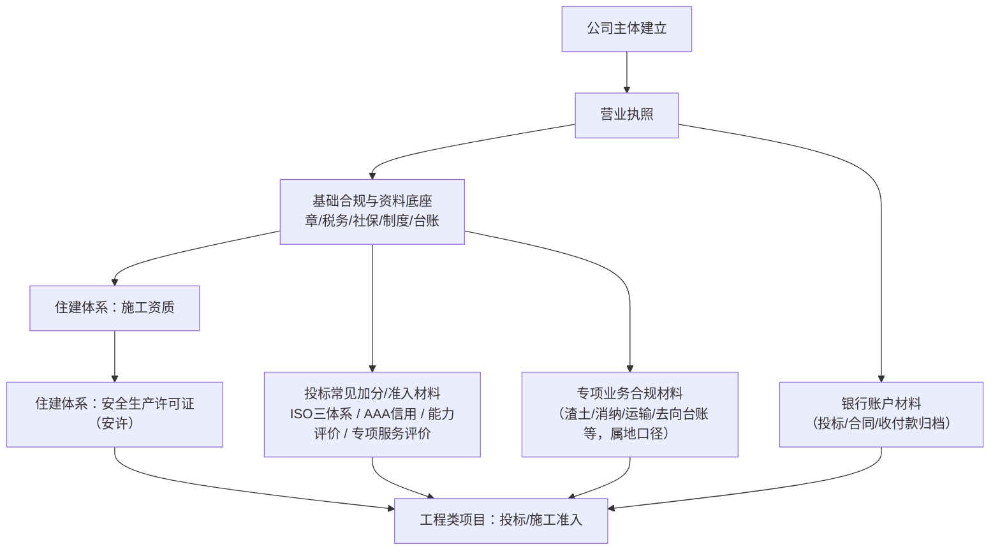
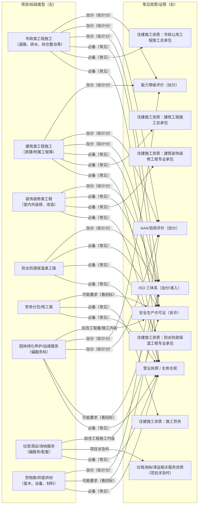
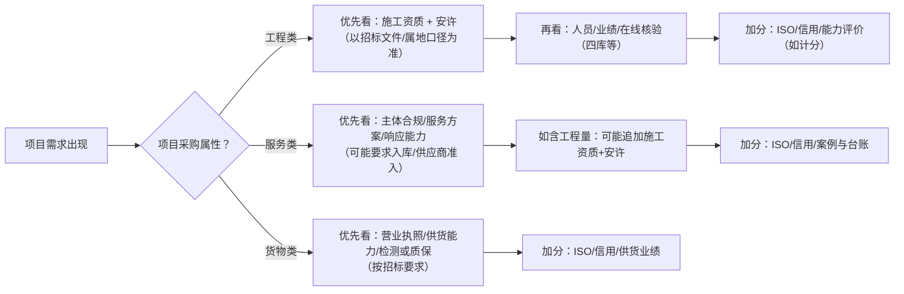
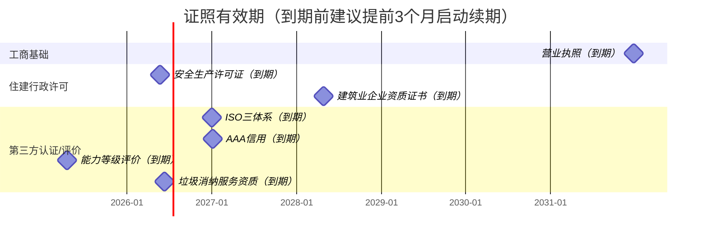
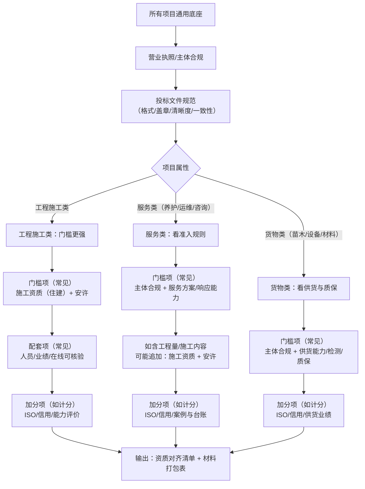

# 图表：资质与项目关系（Mermaid 可渲染）

> 说明：以下为 Mermaid 语法图表，VS Code（或支持 Mermaid 的 Markdown 预览）可直接渲染。
> 若用于对外材料，建议渲染后导出为图片再引用。

---

## 1 资质获取与投标资料路线图（总览）

---

## 2 什么项目 → 需要什么资质（对齐图）

> 你要看的就是这一张：左边“项目/标段类型”，右边“常见资质/证照”。
> 说明：连线标注为“必备/常见/加分”，最终以招标文件与属地口径为准。

---

## 3 项目类型 → 常见门槛/加分（决策树）

---

## 4 证照有效期与续期提醒（时间轴）

> 注：时间轴按证照清单中的“有效期/到期日”绘制；实际投标以招标文件与属地口径为准。

---

## 5 项目级别（门槛强度）→ 资质组合（架构图）

> 说明：这里的“级别”按招标文件的门槛强度理解（门槛/加分/入库），而非固定金额或固定等级；最终以招标文件/属地口径为准。

---

## 6 文档入口（点击跳转）

- 项目速查表：[项目类型-资质与名录速查表.md](02-项目类型-资质与名录速查表.md)
- 证照清单：[资质证书清单.md](01-资质证书清单.md)
- 新手入口：[00-新手入口（按证照分类）.md](00-新手入口（按证照分类）.md)

---

**最后更新时间**：2025年12月25日
