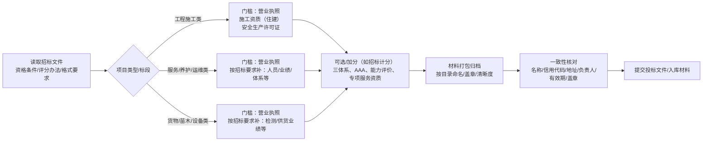
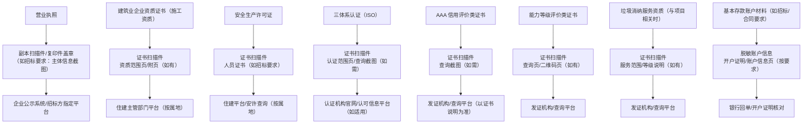
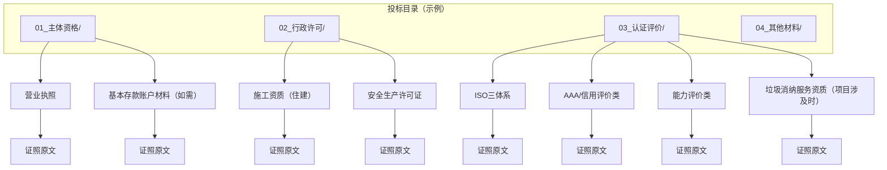

# 投标材料打包表（证照 → 附件 → 核验方式）

> 目标：把“要带什么证”拆成可直接打包的材料清单，避免漏项、错项、信息不一致。
>
> 原则：一切以招标文件/属地口径/评审办法为准；本表提供通用做法与核对点。

> 对外包硬提示（最小披露）：对外提交的投标包/准入包**只提供招标文件明确要求的必要信息**；涉及敏感字段（账号、银行信息、查询编号、内部账号口令等）一律按要求脱敏/遮盖，并仅在内部台账留存。

---

## 1 使用方法（建议 3 步）

1) 先用项目速查表定位本项目的“必备/可选/加分/入库”
- 项目类型 → 资质/入库/名录：[项目类型-资质与名录速查表.md](02-项目类型-资质与名录速查表.md)

2) 再按本表把对应证照材料“打包成套”
- 优先满足“门槛项（必备）”，再补“加分项”。

3) 最后做一致性核对（名称/地址/法人/有效期/章）
- 不确定时以官方查询结果与原件信息为准。
- 对外提交仅做必要一致性核对；涉敏字段按“最小披露+脱敏/遮盖+内部台账”执行。

---

## 2 图表速览（更直观）

### 2.1 招投标“资质对齐 → 打包 → 核验”流程图

### 2.2 “证照 → 附件包 → 核验方式”关系图

### 2.3 打包目录 → 对应证照原文（回跳图）

> 用法：先在你的投标目录里定位文件夹，再按图回跳到“证照原文”核对范围/有效期/措辞。

快速回跳（证照原文）：
- 营业执照：[1-营业执照信息.md](../10-证照（单证）/1-营业执照信息.md)
- 施工资质（总入口）：[2-建筑业企业资质证书.md](../20-施工资质专题/2-建筑业企业资质证书.md)
- 安许：[3-安全生产许可证.md](../10-证照（单证）/3-安全生产许可证.md)
- ISO三体系：[4-三体系管理体系认证证书.md](../10-证照（单证）/4-三体系管理体系认证证书.md)
- 能力评价：[5-建筑工程施工服务企业资质证书（能力等级评价）.md](../10-证照（单证）/5-建筑工程施工服务企业资质证书（能力等级评价）.md)
- 基本存款账户材料：[6-开户许可证（基本存款账户）.md](../10-证照（单证）/6-开户许可证（基本存款账户）.md)
- AAA/信用评价：[7-企业信用与资信AAA（冠捷时速）.md](../10-证照（单证）/7-企业信用与资信AAA（冠捷时速）.md)
- 垃圾消纳服务资质：[8-垃圾消纳企业服务资质证书（一级）.md](../10-证照（单证）/8-垃圾消纳企业服务资质证书（一级）.md)

---

## 3 打包总表（明细备查）

| 证照/证书 | 常见用途（门槛/加分/归档） | 常见呈现方式（以招标为准） | 打包附件（建议同时提供） | 常见核验方式 | 注意事项（高频踩坑） |
|---|---|---|---|---|---|
| 营业执照 | 门槛/归档 | 扫描件；或复印件加盖公章 | 营业执照副本扫描件 主体信息截图（如需，按招标要求最小披露） | 国家企业信用信息公示系统/企查查等（以招标要求） | 公司名称/地址/法人信息必须与其他证照一致；如有变更，优先以最新营业执照及公示系统为准 |
| 建筑业企业资质证书（施工资质） | 门槛 | 扫描件；部分项目要求“资质证书查询截图/二维码页” | 资质证书扫描件（两本如有） 资质范围页/附页（如有） | 住建部门平台查询（按属地） | 资质类别/等级/范围必须覆盖招标要求；注意证书有效期与延续办理窗口 |
| 安全生产许可证 | 门槛（施工类常见） | 扫描件；有时需“安许查询截图” | 安许证扫描件 主要负责人/专职安全员证书（若招标要求） | 住建平台/安许查询（按属地） | 安许通常与施工资质配套使用；注意到期前尽早准备延续材料 |
| 三体系认证（ISO 9001/14001/45001） | 加分/甲方要求 | 扫描件；或复印件加盖章 | 三体系证书扫描件 认证范围页（如证书含） 认证机构/网站查询截图（如需） | 认证机构官网/国家认证认可信息公共服务平台（如适用） | 证书范围要与项目相关；注意监督审核/再认证节点，避免“证书有效但被暂停” |
| 企业信用/资信/诚信 AAA（信用评价类） | 加分 | 扫描件 | AAA证书扫描件 查询编号页/查询截图（如有） | 发证机构/查询平台（以证书说明为准） | 不同AAA证书口径差异大，谨防与招标文件要求不匹配；避免夸大表述 |
| 建筑工程施工服务企业资质证书（能力等级评价） | 加分 | 扫描件 | 评价证书扫描件 查询页/二维码页（如有） | 发证机构/查询平台 | 属第三方评价，通常不能替代行政许可；投标措辞建议用“可作为加分/参考材料” |
| 垃圾消纳企业服务资质证书（一级） | 可选/加分/归档（与项目相关时） | 扫描件 | 资质证书扫描件 服务范围/等级说明（如有） | 发证机构/查询平台 | 仅在涉及渣土、消纳、运输处置等服务/配套环节时使用；按项目要求选用 |
| 开户许可证/基本存款账户材料 | 归档/合同阶段更常见 | 一般不在投标阶段强制；仅在明确要求时提供脱敏版 | 基本存款账户信息（脱敏/遮盖版） 银行开户证明/账户信息页（按要求） | 银行回单/开户证明核对 | 涉敏信息严格脱敏/遮盖（账号、核准号等）；对外包仅最小披露，其余仅内部台账留存 |

---

## 4 打包命名与目录建议（最小可用）

- 建议投标目录结构：
  - `01_主体资格/`（营业执照等）
  - `02_行政许可/`（施工资质、安许等）
  - `03_认证评价/`（三体系、AAA、能力评价等）
  - `04_其他材料/`（按招标文件）

- 建议文件命名（示例）：
  - `01_营业执照_副本_有效至2031-12-25.pdf`
  - `02_施工资质证书_证书一_有效至2028-04-25.pdf`
  - `02_安全生产许可证_有效至2026-05-22.pdf`
  - `03_ISO三体系_有效至2027-01-02.pdf`

---

## 5 一致性核对清单（投标前 2 分钟过一遍）

- 公司全称是否一致（含“有限公司”等字样）
- 统一社会信用代码是否一致
- 地址是否一致（如存在“室/号”差异，按最新证照与官方查询为准）
- 法定代表人/负责人信息是否一致
- 证照有效期是否覆盖投标与合同期关键节点
- 扫描件是否清晰、是否加盖公章（如招标要求）
- 对外材料是否遵循“最小披露”，涉敏字段是否已脱敏/遮盖

---

## 6 关联文档

- 证照清单总览：[资质证书清单.md](01-资质证书清单.md)
- 图表速览（出图用）：[图表-资质与项目关系（Mermaid）.md](03-图表-资质与项目关系（Mermaid）.md)
- 证照文档模板（统一结构）：[证照文档模板（统一结构）.md](07-证照文档模板（统一结构）.md)

---

**最后更新时间**：2025年12月25日
