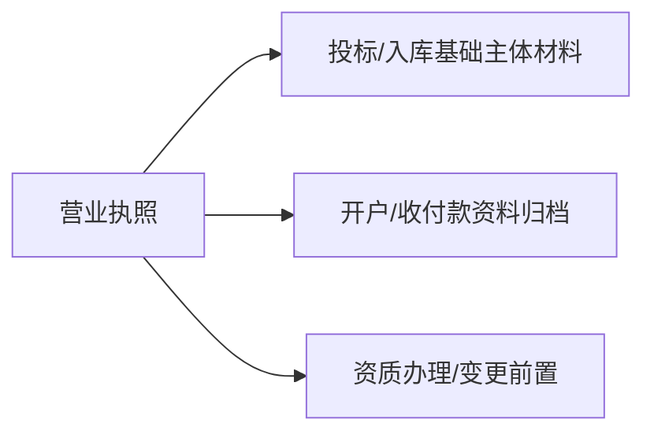

# 营业执照信息

## 1 概览

- 营业执照用于证明企业主体资格；多数投标/入库/开户/资质申报都以此为基础材料。
- 若用于投标、备案或合同，请以营业执照原件或官方查询结果为准。
- 对外材料遵循“最小披露”：仅提供招标/甲方明确要求的信息；敏感字段一律脱敏/遮盖，完整信息仅内部台账留存。

## 2 证照要点（证书信息/核验）

### 2.1 基本信息
- **公司名称**：已脱敏
- **统一社会信用代码**：已脱敏
- **注册资本**：已脱敏
- **公司类型**：有限责任公司(自然人投资或控股)
- **法定代表人**：已脱敏
- **成立日期**：已脱敏
- **营业期限**：2011年12月26日至2031年12月25日

### 2.2 注册地址
已脱敏

> 备注：若用于投标、备案或合同，请以营业执照原件或“国家企业信用信息公示系统”查询结果为准。

### 2.3 经营范围
已脱敏（以营业执照原件/官方查询为准）

### 2.4 登记机关
已脱敏

### 2.5 登记日期
已脱敏

---

## 3 可用于哪些项目/场景（务实口径）

- 工程/服务类投标与供应商准入：几乎所有项目的基础主体材料。
- 办理/变更各类资质、银行开户、税务与社保账户等：常作为“基础证照”。
- 不能替代：住建施工资质、安许、第三方认证/评价类证书。

---

## 4 办理与维护（首次/续期/监督）

营业执照是“注册公司”的结果，不需要先有施工资质。

### 办理顺序（通用）
1. 核名/设立登记（线上或窗口）
2. 领取营业执照
3. 刻章备案
4. 银行开户
5. 税务登记（含税种核定、发票）
6. 社保、公积金开户（后续办理住建资质通常需要人员社保）

### 注册阶段关键点（影响后续资质）
- 经营范围建议包含：园林绿化施工/养护、施工总承包（如计划办住建资质并承接工程）
- 注册地址、法定代表人、股东结构等信息要稳定（资质申报常涉及核验/变更）

---

## 5 材料清单（投标/准入常用）

- 必备材料：营业执照扫描件/电子证照（清晰可读）、最新年检/公示信息（如项目要求）。
- 建议材料：国家企业信用信息公示系统查询截图/打印件（投标现场核验常用）。
- 按业务可能需要：变更记录/章程备案信息（以招标文件/甲方口径为准）。

---

## 6 常见问题/风险点（高频踩坑）

- 企业名称/地址/统一社会信用代码与其他材料不一致（细微差异也会被卡）。
- 扫描件不清晰、信息缺失，导致现场核验失败。
- 使用了非最新版本（发生变更但未更新投标材料包）。

---

## 7 关联文档

- 开户许可证（基本存款账户）：[6-开户许可证（基本存款账户）.md](6-开户许可证（基本存款账户）.md)
- 证照总清单：[资质证书清单.md](../00-入口与索引/01-资质证书清单.md)
- 新手入口：[00-新手入口（按证照分类）.md](../00-入口与索引/00-新手入口（按证照分类）.md)
- 项目类型 → 资质/入库/名录：[项目类型-资质与名录速查表.md](../00-入口与索引/02-项目类型-资质与名录速查表.md)

---

**最后更新时间**：2025年12月25日
