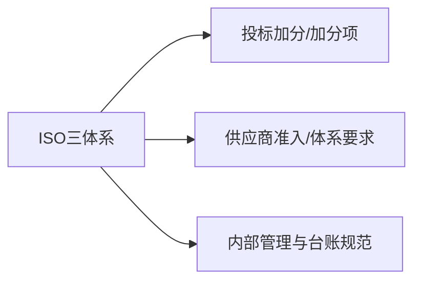

# 三体系管理体系认证证书（ISO 9001 / ISO 14001 / ISO 45001）

## 1 概览

- 本文件根据您提供的三张证书截图整理。
- 如用于投标/备案，请以证书原件、证书二维码查询结果与认证机构官网公示为准。
- 对外材料遵循“最小披露”：仅提供招标/甲方明确要求的信息；敏感字段一律脱敏/遮盖，完整信息仅内部台账留存。

## 2 证照要点（企业信息/证书信息/核验）（按截图）

### 2.1 企业基本信息（截图可见）
- **企业名称**：已脱敏
- **统一社会信用代码**：已脱敏
- **注册地址**：已脱敏
- **经营地址**：已脱敏
- **邮编**：已脱敏

---

### 2.2 证书信息（按截图）

### 1) 环境管理体系认证证书（ISO 14001）
- **证书名称**：环境管理体系认证证书
- **注册号**：已脱敏
- **标准**：GB/T 24001-2016 / ISO 14001:2015
- **认证范围**：城市园林绿化及养护；花卉、树木销售、绿植租赁及相关环境管理活动
- **发证日期**：2024年01月02日
- **换证日期**：2024年01月04日
- **证书有效期至**：2027年01月02日
- **初次颁发日期**：2018年01月03日

### 2) 质量管理体系认证证书（ISO 9001）
- **证书名称**：质量管理体系认证证书
- **注册号**：已脱敏
- **标准**：GB/T 19001-2016 / ISO 9001:2015
- **认证范围**：城市园林绿化及养护；花卉、树木销售、绿植租赁
- **发证日期**：2024年01月02日
- **换证日期**：2024年01月04日
- **证书有效期至**：2027年01月02日
- **初次颁发日期**：2018年01月03日

### 3) 职业健康安全管理体系认证证书（ISO 45001）
- **证书名称**：职业健康安全管理体系认证证书
- **注册号**：已脱敏
- **标准**：GB/T 45001-2020 / ISO 45001:2018
- **认证范围**：城市园林绿化及养护；花卉、树木销售、绿植租赁及相关职业健康安全管理活动
- **发证日期**：2024年01月02日
- **换证日期**：2024年01月04日
- **证书有效期至**：2027年01月02日
- **初次颁发日期**：2018年01月03日

---

## 3 可用于哪些项目/场景（务实口径）

- 常见作为投标加分项或供应商准入材料（是否计分以招标文件为准）。
- 用于展示企业在质量/环境/职业健康安全方面的管理体系能力；一般不能替代住建施工资质与安许。

---

## 4 办理与维护（三体系认证获取/监督/换证）

三体系（质量/环境/职业健康安全）本质是“管理体系认证”，不是行政许可；通常由具备资质的第三方认证机构实施审核发证。

### 1) 注册（办理）全流程——按“能照着做”的步骤写

把三体系“办下来”，一般可以按 8 步走（企业自建或找咨询辅导都适用）：

1. **定范围（先定对，再做事）**
   - 明确：要做 ISO 9001/14001/45001 哪几个体系
   - 明确：认证范围（写在证书上的业务范围），以及涉及的场所（注册地址/经营地址/项目现场）
   - 原则：范围一定要能被“项目合同 + 现场 + 记录”支撑，避免写大了审核过不去

2. **选认证机构/确定审核人日与计划**
   - 选机构前做两件事：
     - 能否在官网/二维码查询该机构及证书真伪
     - 该机构是否有园林绿化/施工类企业审核经验
   - 同时确认：审核周期（通常 1 阶段 + 2 阶段）、计划日期、预计不符合项整改周期

3. **建立体系文件（把“该怎么管”写清楚）**
   - ISO 9001：合同评审、采购/分包、施工/养护过程控制、检验与验收、不合格控制、客户投诉与改进
   - ISO 14001：环境因素识别、目标指标、固废/危废、噪声扬尘、合规评价、应急预案
   - ISO 45001：危险源辨识与风险评价、PPE、特种作业、班前教育、应急演练、事故/事件处置
   - 输出物：手册/程序文件/表单（或等效的文件体系）

4. **体系运行并留痕（审核最看这个）**
   - 不是“写完文件就能拿证”，必须按文件运行并形成记录
   - 施工类企业常见需要准备：项目现场的安全/环境/质量记录、分包管理记录、材料进场验收、隐蔽验收、整改闭环等

5. **内审 + 管理评审（拿证前必做的闭环）**
   - 至少完成一次内部审核并形成：内审计划、检查表、报告、不符合整改证据
   - 形成一次管理评审纪要：目标达成情况、资源与改进、风险与机会、纠正措施等

6. **提交认证申请（进入“注册/受理”阶段）**
   - 向认证机构提交：认证申请书/合同、企业证照、组织架构、场所清单、员工与项目概况、拟认证范围等
   - 机构会根据规模与风险确定审核人日与抽样项目

7. **一阶段审核（文件/准备度审查）**
   - 重点：文件是否齐、范围是否合理、关键过程是否识别到位、是否具备进入二阶段的条件
   - 常见结果：开出“需要补充/调整”的问题清单

8. **二阶段审核（现场审核）→ 整改 → 发证 → 年度监督**
   - 二阶段会抽查：办公场所、项目现场、记录台账、人员访谈
   - 对不符合项：按要求提交整改证据，通过后签发证书
   - 拿证后：通常每年监督审核一次；到期前做再认证（换证）

### 2) 常见“硬要求/容易卡点”（园林绿化/施工企业高频）
- **范围与实际不一致**：范围写得很大，但现场/记录支撑不足，易被要求缩小范围或补材料
- **施工现场证据链不完整**：分包管理、材料进场验收、隐蔽验收/过程检验、班前教育、动火/高处作业票据等
- **环境/职安合规证据不足**：环境因素清单、危险源清单、法律法规清单与合规性评价、应急演练记录
- **人员培训与持证**：特种作业（电工/焊工/登高等）、安全员、劳保发放与教育培训记录

### 3) 典型材料清单（做“能被抽查”的版本）
- 企业基础：营业执照、组织架构、岗位职责、场所清单
- 体系文件：手册/程序文件/作业指导书/表单
- 运行记录：
  - 合同评审、供应商评价、材料进场验收、施工过程检查、竣工验收
  - 环境因素识别、固废/危废台账、噪声扬尘控制记录、合规评价
  - 危险源辨识、风险控制措施、PPE发放、班前教育、特种作业证、应急演练、事故/事件记录
- 内审与管理评审：内审计划/报告、不符合整改、管理评审纪要

### 4) 时间节奏（经验区间）
- **从启动到拿证**：常见为数周到数月不等（取决于企业基础、项目现场、体系运行记录是否齐、以及审核排期）
- **有效期与维护**：证书通常3年有效；每年监督审核；到期再认证（换证）

---

## 5 材料清单（投标/准入常用）

- 必备材料：三张证书扫描件/电子证书、注册号、二维码/官网核验截图（以认证机构口径为准）。
- 建议材料：年度监督审核/再认证相关记录（如项目要求）、认证范围页清晰截图。

---

## 6 常见问题/风险点（高频踩坑）

- 认证范围写大但现场/记录支撑不足。
- 施工现场证据链不完整，导致审核不符合项整改周期拉长。
- 核验信息与营业执照/其他附件信息不一致。

---

## 7 关联文档

- 项目类型 → 资质/入库/名录：[项目类型-资质与名录速查表.md](../00-入口与索引/02-项目类型-资质与名录速查表.md)
- 证照总清单：[资质证书清单.md](../00-入口与索引/01-资质证书清单.md)
- 新手入口：[00-新手入口（按证照分类）.md](../00-入口与索引/00-新手入口（按证照分类）.md)
- 施工资质总入口：[2-建筑业企业资质证书.md](../20-施工资质专题/2-建筑业企业资质证书.md)
- 安全生产许可证：[3-安全生产许可证.md](3-安全生产许可证.md)

---

**最后更新时间**：2025年12月25日
