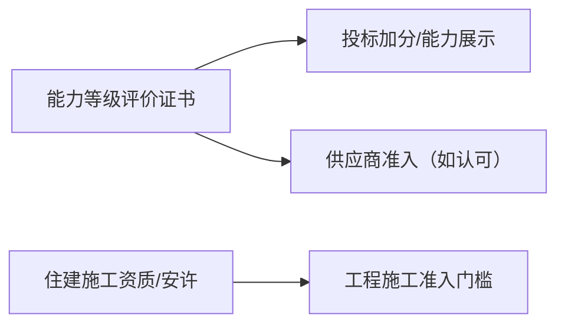

# 建筑工程施工服务企业资质证书（能力等级评价）

## 1 概览

- 本文件根据您提供的两张证书截图整理。
- 这类证书通常属于“行业/第三方机构能力等级评价（认证类/评价类）”，与住建主管部门核发的《建筑业企业资质证书》不是同一体系。
- 如用于投标/备案，请以证书二维码/查询网站的核验结果为准。
- 对外材料遵循“最小披露”：仅提供招标/甲方明确要求的信息；敏感字段一律脱敏/遮盖，完整信息仅内部台账留存。

## 2 证照要点（证书信息/核验）（按截图）

### 1) 基本信息
- **证书名称**：建筑工程施工服务企业资质证书
- **企业名称**：已脱敏
- **等级**：一级
- **有效期**：2022年04月18日 至 2025年04月17日
- **资质标准/依据**：BJQCYX 399-2022《建筑工程施工服务企业能力水平等级评价标准》（截图可见）

### 2) 证书编号（白底证书截图可见）
- **证书编号**：已脱敏

### 3) 查询/核验渠道（截图可见）
- **www.cecbid.org.cn**（中国招投标网）
- **www.qcyxrz.cn**（全国企业认证系统）

### 4) 经营地址（白底证书截图可见）
- **经营地址**：已脱敏

### 5) 服务内容（白底证书截图可见）
截图右侧“服务内容”列出（按可辨识内容整理）：
- 建筑装饰装修工程专业承包
- 建筑幕墙工程专业承包
- 消防设施工程专业承包
- 防水防腐保温工程专业承包
- 建筑工程施工总承包

> 说明：如您需要我把“服务内容”逐条按证书原文精确复刻（包括是否有“市政/机电/其他条目”），建议提供更高清的原图或把右侧文字区域再放大截图一张。

---

## 3 可用于哪些项目/场景（务实口径）

- 常见放在投标材料的“能力证明/体系与认证/荣誉与评价”章节（是否计分以招标文件为准）。
- 一般不能替代住建施工资质或安许；当招标明确要求住建资质/安许时，应以住建体系证照为主。

---

## 4 办理与维护（注册/申办/监督/续期）

这类证书的“注册流程/申办流程”通常不是到住建部门窗口办理，而是：
**在评价/认证机构的系统中提交申请 → 资料审核（必要时现场/远程核查）→ 公示/发证 → 年度监督/到期再评价**。

下面给出一套可以直接照着执行的流程清单。

### 1) 第0步：先判断“值不值得办/办哪个等级”
- **用途场景**：招投标加分、供应商准入、能力展示、信用背书
- **关键点**：确认招标文件是否明确要求该类证书；如果招标文件只认可住建施工资质/安许，那么应以住建资质为主。

### 2) 第1步：确定评价范围（很关键）
- 把证书上要体现的“服务内容/专业方向”先定下来（例如装饰、幕墙、消防、防水、房建总包等）
- 原则：范围要与企业真实能力匹配，并能被“人员/业绩/制度/财务”材料支撑

### 3) 第2步：选择评价/认证机构并确认规则
建议在正式签约前，把下面几件事确认清楚：
- 是否提供**公开可查**的证书核验渠道（二维码/官网查询）
- 评价标准采用哪个版本（例如截图中的 BJQCYX 399-2022）
- 评价指标维度：是否包含企业资产、人员证书、业绩、管理体系、信用记录等
- 审核方式：仅资料评审还是含现场核查/电话核查
- 费用、周期、年度监督规则、到期再评价规则

### 4) 第3步：准备材料（按“能被核验”准备）
不同机构要求会有差异，但通常会要到以下类别：

**A. 企业主体材料**
- 营业执照
- 法定代表人/联系人信息
- 经营场所证明（如要求）

**B. 人员与能力材料**
- 关键岗位人员清单（项目经理/技术负责人/质量安全等）
- 人员证书（职称、注册类、岗位类、技能类，按机构要求提供）
- 劳动关系/社保（若机构要求核验）

**C. 工程业绩与合同材料**（常见“评级核心”）
- 典型项目清单
- 合同/中标通知书/验收证明/结算或发票等可核验佐证（以机构口径为准）

**D. 管理与合规材料**
- 质量/安全/环境相关制度与台账
- 如已有三体系认证（ISO 9001/14001/45001），通常对评价加分（以机构规则为准）

**E. 财务与信用材料**
- 财务报表/审计（若要求）
- 诚信/信用记录（若要求）

### 5) 第4步：提交申请与受理
- 在机构平台或按其要求提交电子材料
- 受理后通常会给出“补正清单”（缺啥补啥）

### 6) 第5步：评审/核查（可能包含抽查）
- 资料评审：核对企业信息、范围、人员、业绩、制度等
- 抽查方式：可能会电话核实项目、要求补充证明、或安排现场/远程核查

### 7) 第6步：发证与公示
- 通过后发证（电子/纸质）
- 保存好：证书图片、注册号、查询链接/二维码核验截图（投标用很有价值）

### 8) 第7步：维护与续期
- 关注有效期：本证书有效期至 **2025-04-17**
- 若有年度监督/抽查：按机构要求准备年度材料
- 到期前启动再评价/换证（通常需要提前准备业绩与人员材料）

---

## 5 材料清单（投标/准入常用）

- 必备材料：证书扫描件/电子证书、证书编号、查询网站入口与核验截图。
- 建议材料：与证书服务内容对应的业绩材料链（合同/验收/结算/发票等，按项目口径）。
- 按业务可能需要：人员证书、制度台账、财务与信用材料（以评价机构/甲方清单为准）。

---

## 6 常见问题/风险点（高频踩坑）
- 评价范围写得过大，但无法提供对应业绩/人员/制度支撑
- 业绩材料链不闭合（缺合同、缺验收、缺能核验的关键信息）
- 企业基本信息不一致（名称/地址/统一社会信用代码与附件对不上）
- 证书核验渠道无法当场查询（投标时会吃亏）

---

## 7 关联文档

- 项目类型 → 资质/入库/名录：[项目类型-资质与名录速查表.md](../00-入口与索引/02-项目类型-资质与名录速查表.md)
- 证照总清单：[资质证书清单.md](../00-入口与索引/01-资质证书清单.md)
- 新手入口：[00-新手入口（按证照分类）.md](../00-入口与索引/00-新手入口（按证照分类）.md)
- 施工资质总入口：[2-建筑业企业资质证书.md](../20-施工资质专题/2-建筑业企业资质证书.md)
- 安全生产许可证：[3-安全生产许可证.md](3-安全生产许可证.md)
- ISO三体系：[4-三体系管理体系认证证书.md](4-三体系管理体系认证证书.md)

---

**最后更新时间**：2025年12月25日
