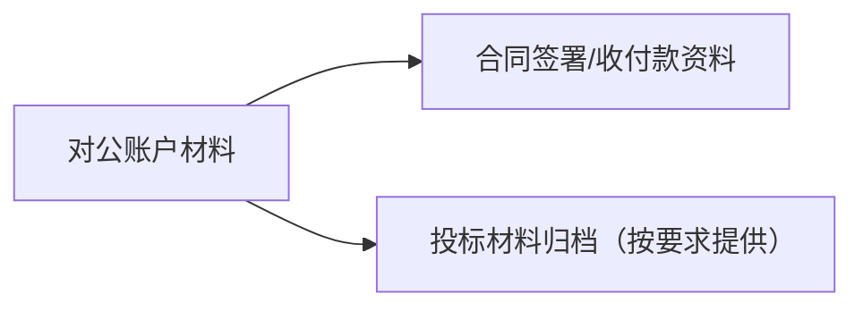

# 开户许可证（基本存款账户）

## 1 概览

- 本文件根据您提供的《开户许可证》截图整理。
- 该证照属于银行账户管理相关材料，常用于投标/合同/收付款资料归档；不属于住建施工资质或行政许可。
- 对外材料遵循“最小披露”：仅提供招标/甲方明确要求的信息；账号、核准号等敏感字段一律脱敏/遮盖，完整信息仅内部台账留存。

## 2 证照要点（证照信息）（按截图）

- **证照名称**：开户许可证
- **企业名称**：已脱敏
- **核准号**：已脱敏
- **编号**：已脱敏
- **法定代表人（单位负责人）**：已脱敏
- **开户银行**：已脱敏
- **账号**：已脱敏（仅保留内部台账）
- **发证日期**：2018年03月14日

---

## 3 可用于哪些项目/场景（务实口径）

- 投标/合同/收付款资料归档：用于证明对公账户基础信息（以项目要求为准）。
- 不能替代：住建施工资质、安许、第三方认证/评价证书。

---

## 4 办理与维护（首次/续期/监督）

“开户许可证/基本存款账户”本质是：企业完成工商注册后，在银行开立对公基本账户（用于日常收付款、工资、税款等）。

### 1) 办理流程（通用，可照着做）
1. **先完成公司注册**：拿到营业执照、法定代表人信息确定、章刻制完成
2. **选择开户银行与网点**：对比开户费、年费、网银/回单服务、开户地址便利性
3. **预约开户**：按银行要求提交预审材料，确定上门核验/面签时间
4. **现场面签/尽调核验**：银行核验企业真实经营、注册地址/经营地址、实际控制人/受益人信息等（不同银行严格程度不同）
5. **开户资料归档与系统录入**：提交全套材料，银行录入、审核
6. **领取开户相关资料**：包含基本账户信息、网银/U盾、印鉴卡等（历史上可能包含《开户许可证》）

---

## 5 材料清单（投标/准入常用）

不同银行会有差异，但常见会要：

- **企业主体材料**：营业执照（正副本或电子证照）、公司章程/备案信息（按银行要求）
- **人员材料**：法定代表人身份证原件及复印件、经办人身份证及授权委托书（如经办人办理）
- **印章/印鉴**：公章、财务章、法人章（及印鉴留存）
- **地址证明**：租赁合同/房产证明/场地照片等（银行尽调常用）
- **合规信息**：受益所有人信息、反洗钱/客户尽职调查表、经营范围与资金用途说明

---

## 6 常见问题/风险点（高频踩坑）

- 地址/经营情况无法核验（场地不一致、联系不上、资料不完整）
- 法人无法到场或授权链不完整
- 公司信息与材料不一致（名称、统一社会信用代码、地址、股东信息等）

---

## 7 关联文档

- 营业执照：[1-营业执照信息.md](1-营业执照信息.md)
- 证照总清单：[资质证书清单.md](../00-入口与索引/01-资质证书清单.md)
- 新手入口：[00-新手入口（按证照分类）.md](../00-入口与索引/00-新手入口（按证照分类）.md)
- 项目类型 → 资质/入库/名录：[项目类型-资质与名录速查表.md](../00-入口与索引/02-项目类型-资质与名录速查表.md)

---

**最后更新时间**：2025年12月25日
