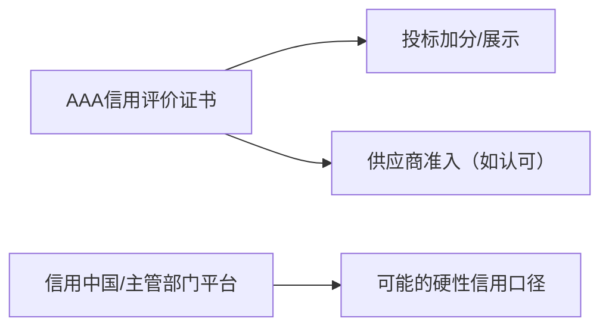

# 企业信用/资信/诚信经营 AAA 证书（第三方信用评价）

## 1 概览

- 本文件根据您提供的 AAA 证书截图整理（多张证书同一查询编号）。
- 这类证书通常属于第三方信用服务机构出具的“企业信用评价/资信评价/诚信示范”类材料，常用于投标加分、供应商准入、企业形象展示。
- 办理前建议先确认招标文件是否认可该机构/口径；否则可能只能作为形象材料。
- 对外材料遵循“最小披露”：仅提供招标/甲方明确要求的信息；查询编号等敏感字段一律脱敏/遮盖，完整信息仅内部台账留存。

## 2 证照要点（查询/备案/有效期）（按截图）

- **企业名称**：已脱敏
- **备案信息（截图可见）**：中华人民共和国内企业征信业务经营备案（编号：10007）
- **查询编号**：已脱敏
- **签发日期**：2024年01月05日
- **有效期至**：2027年01月04日
- **查询地址**：
  - www.creditchina315.com（中国企业信用信息网）
  - www.guanjiess.com（冠捷时速官网）
- **出具机构（截图可见）**：北京冠捷时速信用管理有限责任公司

---

## 3 可用于哪些项目/场景（务实口径）

- 投标加分、供应商准入、企业形象展示（是否认可/是否计分以招标文件为准）。
- 不能替代：住建施工资质、安许、以及政府/行业主管部门指定平台口径的信用记录。

---

## 4 办理与维护（首次/续期/监督）

1) **企业信用等级证书**：AAA级（查询编号：已脱敏）

2) **资信等级证书**：AAA级（查询编号：已脱敏）

3) **诚信经营示范单位证书**：AAA级诚信经营示范单位（查询编号：已脱敏）

4) **重合同守信用企业证书**：AAA级重合同守信用企业（查询编号：已脱敏）

5) **质量、服务诚信单位证书**：AAA级质量、服务诚信单位（查询编号：已脱敏）

---

这类证书通常不是到住建部门办理，而是：
**向第三方信用服务机构提交申请 → 资料审核/评价 → 出具证书 → 上网公示/核验 → 到期续评**。

### 4.1 先判断：招标/甲方到底认可哪种“信用”
这类 AAA 证书的最大风险不是“办不下来”，而是“办下来了不被认可/不计分”。建议办理前先做 3 个判断：

1. **是否指定平台/口径**：有的项目只认“信用中国/省市公共信用平台/行业主管部门平台”记录；第三方 AAA 证书只能作为加分材料或形象材料。
2. **是否指定机构**：若招标文件点名某协会/某平台/某评价机构，需严格按其要求办理。
3. **是否要求可核验**：通常至少要求网站/二维码可查，且企业信息与营业执照一致。

### 4.2 办理流程（可直接照着走）
1. **确定要办的证书组合**：常见组合包含“企业信用等级/资信等级/诚信示范/重合同守信用/质量服务诚信”等（本文件已整理为 5 类）。
2. **锁定核验渠道**：确认查询网站、查询编号规则、二维码是否长期有效，并预留核验截图位置（后续投标直接用）。
3. **准备材料包**：按下方清单一次性打包，减少补正轮次。
4. **提交申请/受理**：按机构模板填报企业信息；注意企业名称、统一社会信用代码、地址要与营业执照完全一致。
5. **评价审核**：机构通常会做信用信息核验 + 材料一致性审核（必要时电话回访）。
6. **出证/公示/核验留存**：拿到证书后当天完成核验截图留存，并把查询入口、查询编号写入投标资料库。
7. **续评维护**：到期前准备续评材料（财务、纳税、履约等更新材料），避免证书断档。

---

## 5 材料清单（投标/准入常用）

不同机构差异很大，但通常会要以下几类。建议你按“必备/建议/加分”三档准备，基本都能覆盖：

### A. 必备材料（几乎一定会要）
- **企业主体**：营业执照（统一社会信用代码清晰）、法人身份证（或信息页）、经办人身份证。
- **授权文件**：授权委托书（法人签字/盖章）、联系方式。
- **基础信息**：公司简介、组织架构、主营业务说明、办公地址证明（如要求）。
- **信用承诺类**：信用承诺书/无重大违法声明（按机构模板）。

### B. 建议材料（用于减少退回、提升评级一致性）
- **财务与纳税**：近 1-3 年财务报表（或审计报告如有）、纳税证明/完税证明（如能提供）。
- **社保与用工**：社保缴纳证明或人员花名册（按机构要求）。
- **履约与业绩**：典型合同 + 验收/结算/对账 + 回款/发票（能闭环最关键）。
- **信用信息截图**：信用中国/国家企业信用信息公示系统的查询截图（用于一致性核验）。

### C. 加分材料（不一定必需，但常用于“好看/更稳”）
- **住建类证照**：施工资质证书、安许证等。
- **体系与能力**：ISO 三体系、能力评价类证书。
- **荣誉与证明**：守合同重信用（如有官方口径）、表彰、获奖、专利/软著等。

---

## 6 常见问题/风险点（高频踩坑）

- **核验渠道不可用**：招标方现场核验打不开网站/二维码，容易被判无效
- **机构口径不被认可**：招标文件指定了“信用中国/省市信用平台”或指定机构，则这类证书可能只能算加分材料
- **证书信息不一致**：企业名称/统一社会信用代码/地址与营业执照不一致

## 7 关联文档

- 项目类型 → 资质/入库/名录：[项目类型-资质与名录速查表.md](../00-入口与索引/02-项目类型-资质与名录速查表.md)
- 证照总清单：[资质证书清单.md](../00-入口与索引/01-资质证书清单.md)
- 新手入口：[00-新手入口（按证照分类）.md](../00-入口与索引/00-新手入口（按证照分类）.md)
- ISO三体系：[4-三体系管理体系认证证书.md](4-三体系管理体系认证证书.md)

---

**最后更新时间**：2025年12月25日
