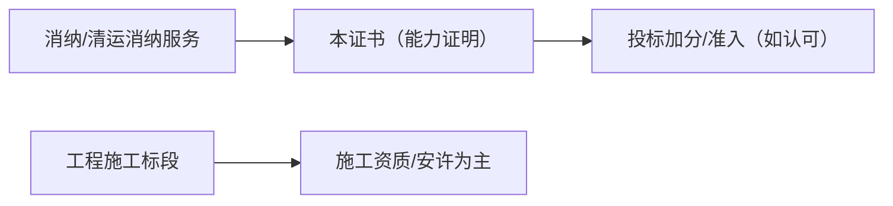

# 垃圾消纳企业服务资质证书（一级）

## 1 概览

- 本文件根据您提供的《垃圾消纳企业服务资质证书》截图整理。
- 该证书属于第三方机构的服务能力/资质评价类材料，常用于投标加分、供应商准入或业务能力展示。
- 对外材料遵循“最小披露”：仅提供招标/甲方明确要求的信息；敏感字段一律脱敏/遮盖，完整信息仅内部台账留存。

## 2 证照要点（证书信息/核验）（按截图）

- **证书名称**：垃圾消纳企业服务资质证书
- **等级**：一级
- **统一证书编号**：已脱敏

### 2.1 服务内容（截图可见）
- **服务内容**：全国范围内的垃圾消纳企业服务（以上服务范围与其涉及有效的法律法规要求一并使用；行政部门决定禁止的经营项目除外）。

### 2.2 企业信息（截图可见）
- **企业名称**：已脱敏
- **统一社会信用代码**：已脱敏
- **法人代表**：已脱敏
- **注册地址**：已脱敏

### 2.3 有效期与标准（截图可见）
- **证书备案日期**：2023年06月12日
- **证书有效期**：2023年06月12日 至 2026年06月11日
- **评价标准**：Q/HXRQ002-2022
- **委托评价机构**：惠信企业信用评估有限公司
- **标准备案机构**：国家标准化管理委员会

### 2.4 核验渠道（截图可见）
- **证书备案查询**：www.hxrq-credit.cn

### 2.5 持证须知（截图可见）
一、本证书有效期三年，请在有效期到期前三十日内办理续期手续，逾期未办理完成，证书视为无效。

二、不得涂改、转借、伪造、出租、出售、转让。

三、本证书与牌匾具有同等效力，在中华人民共和国区域内通用。

---

## 3 可用于哪些项目/场景（务实口径）

- 作为“垃圾消纳/清运消纳服务能力”材料，用于投标文件的“能力证明/加分项/供应商准入”章节（是否计分以招标文件为准）。
- 如项目属于工程施工标段，本证书通常**不能替代**住建体系的施工资质与安许。

---

## 4 办理与维护（注册/申办/续期）

这类“服务资质/能力评价证书”通常不走住建行政许可窗口，而是：
**向评价机构提交申请 → 资料审核（必要时核查）→ 出具证书 → 上网备案/核验 → 到期复评/换证**。

### 4.1 先判断：你要“消纳服务”做到什么边界（决定材料清单）
垃圾消纳相关业务通常会被拆成几种口径，不同口径对材料要求差异很大：

- **A 仅做“消纳服务管理/对接/代理”**：偏服务能力展示，材料以企业主体 + 服务方案 + 业绩为主。
- **B 涉及“运输/清运”**：通常需要车辆、驾驶员/押运、安全与环保台账等可核验材料；有的地区/项目还会要求相应的行政许可/备案。
- **C 涉及“场地消纳/处置”**：往往更看重场地权属/租赁、环评/验收、场地管理制度、合规证明等。

> 建议做法：先把招标文件/甲方准入要求里的“垃圾类型、作业范围、处置去向、运输是否自有”四项写清楚，再按下方清单准备材料。

### 4.2 申办流程（可直接照着走）
1. **明确用途与认可口径**：先确认投标/甲方是否认可“垃圾消纳企业服务资质证书（一级）”作为加分或准入材料，以及是否要求必须可在线核验。
2. **对齐证书信息字段**：提前准备要上证书的固定字段（企业名称、统一社会信用代码、法人、注册地址、服务内容/范围）。
3. **准备材料（按“可核验”原则）**：优先准备能被第三方或甲方核验的材料（合同、台账、发票/回款、官方查询截图等）。
4. **提交申请/受理**：按机构平台/邮箱提交，收到补正清单后 1-2 轮补齐。
5. **评价审核/抽查**：常见抽查点包括：业绩真实性、人员与设备匹配度、制度文件与台账是否一致、是否存在重大不良信用记录。
6. **出证与核验留存**：拿到证书后立即完成网站/二维码核验，并保存核验截图（投标常用）。
7. **维护与续期**：按“持证须知”提前办理续期（建议至少提前 1-3 个月准备材料），避免到期影响投标。

---

## 5 材料清单（投标/准入常用）

> 说明：以下按“必备/建议/按业务可能需要”分档；不同机构/项目口径差异很大，以对方清单为准。

### 5.1 申请材料清单（建议你按“必备/建议/按业务可能需要”打包）

#### A. 必备材料（几乎所有机构都会要）
- **企业主体**：营业执照（统一社会信用代码清晰）、法人身份证复印件（或信息页）、经办人身份证。
- **授权文件**：授权委托书（法人签字/盖章）、经办人联系方式。
- **基础信息表**：公司简介、注册地址/办公地址、组织架构、主营业务说明。
- **信用与合规声明**：企业信用承诺书/无重大违法声明（按机构模板）。

#### B. 建议材料（用于提高通过率/拿到更高等级）
- **服务方案**：服务流程、人员配置、作业组织、应急预案、投诉处理、质量与安全控制。
- **制度与台账**：安全生产、环保管理、车辆/设备管理、人员培训、作业记录台账（可脱敏）。
- **业绩证明（可核验）**：近 1-3 年典型合同 + 验收/结算/对账 + 回款/发票（能对应上合同更好）。
- **人员与设备清单**：核心管理人员、现场作业人员、车辆/机械/设备（含证照/年检/保险信息如有）。

#### C. 按业务可能需要（与你实际承接范围强相关）
- **涉及运输/清运**：车辆行驶证、营运/运输资质或备案（如当地或项目要求）、驾驶员资格材料、车辆 GPS/北斗截图（如项目要求）。
- **涉及消纳场地/处置**：场地权属/租赁合同、场地平面示意、环评/验收/备案材料（如当地监管要求）、场地管理制度与进出场台账样例。
- **涉及建筑垃圾/渣土等特定类别**：按项目/地区要求提供对应的主管部门备案/许可/处置去向证明材料。

---

## 6 常见问题/风险点（高频踩坑）

### 6.1 常见被退回/被质疑点（按投标经验最常见）
- **无法核验**：网站打不开/二维码失效/查询编号查不到。
- **服务范围写大但材料支撑不足**：写“全国范围/全流程处置”但拿不出匹配业绩或合规材料。
- **主体信息不一致**：企业名称/统一社会信用代码/地址与营业执照不一致（包括“室/号”的细微差异）。
- **业绩不可核验**：只有合同无验收/结算/回款等佐证。

---

## 7 关联文档

- 项目类型 → 资质/入库/名录：[项目类型-资质与名录速查表.md](../00-入口与索引/02-项目类型-资质与名录速查表.md)
- 证照总清单：[资质证书清单.md](../00-入口与索引/01-资质证书清单.md)
- 施工资质总入口：[2-建筑业企业资质证书.md](../20-施工资质专题/2-建筑业企业资质证书.md)
- 安全生产许可证：[3-安全生产许可证.md](3-安全生产许可证.md)
- ISO三体系：[4-三体系管理体系认证证书.md](4-三体系管理体系认证证书.md)

---

**最后更新时间**：2025年12月25日
